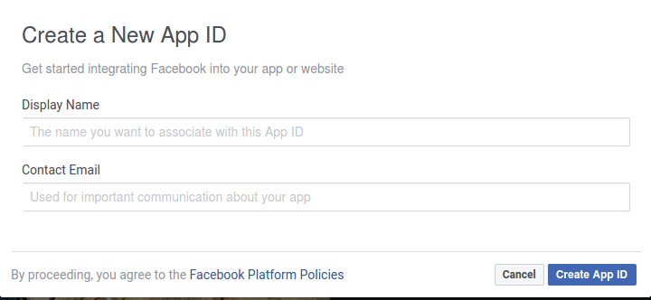
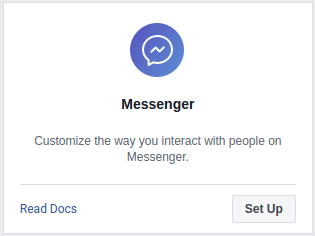
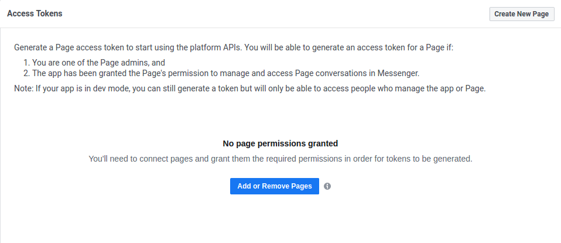
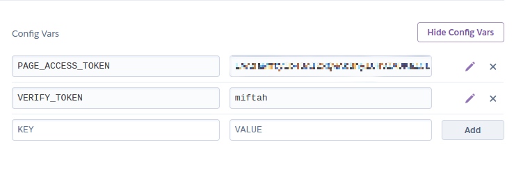
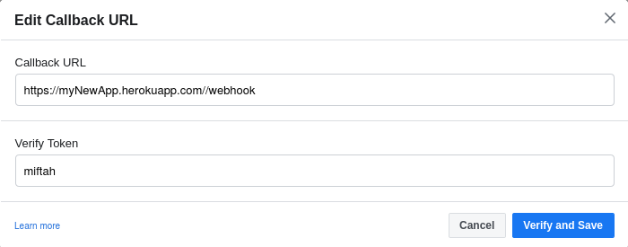
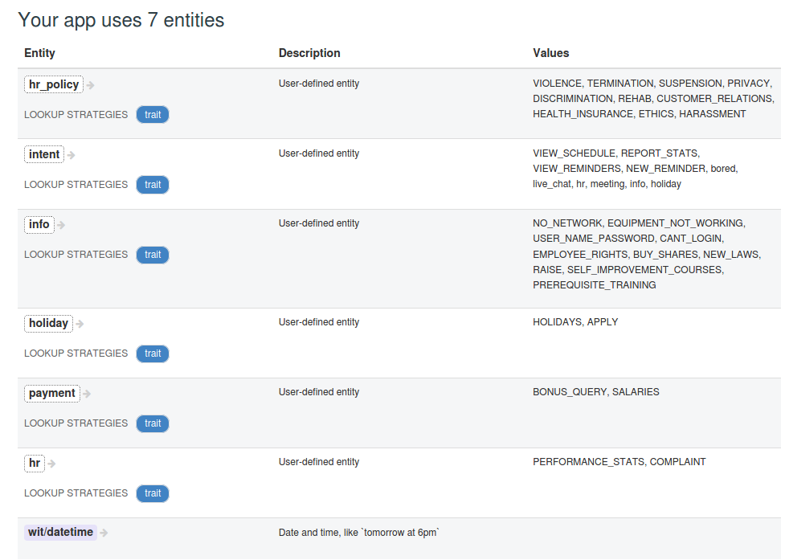

# Alfred the HR Butler


# Table of Contents
1. [Inspiration](#inspiration)
2. [What it does](#what-it-does)
3. [How we built it](#how-we-built-it)
4. [Challenges we ran into](#challenges-we-ran-into)
5. [Accomplishments that we're proud of](#accomplishments-that-we're-proud-of)
6. [What we learned](#what-we-learned)
7. [What's next for Alfred](#what's-next-for-alfred)
8. [Built With](#built-with)
9. [Get Started](#get-started)
10. [Env Setup](#env-setup)
11. [WebHook Setup](#webhook-setup)
12. [Page and App Setup](#page-and-app-setup)
13. [Wit.AI Setup](#wit.ai-setup)
14. [Authors](#authors)
15. [Credit](#credit)


## Inspiration

A large office comprising of thirty or more employees can become a chaotic environment if not well managed. Lack of systematic workplace collaboration systems can lead to low company morale and increased stress levels. Extensive bureaucratic management styles can help mediate the chaos and bring order to an office even with a large number of employees by systematically conducting meetings and such. However, micromanagement and excessive restrictions can hinder creativity and therefore innovation. We tried to develop a product that can help bring some order to the chaos of the office while also providing a platform where everyone has a voice. We wanted to do all of this while also not creating barriers to individual creativity. **Enter Alfred - A personal chatbot that helps everyone stay on schedule and on top of their work game by answering any workplace questions they might have.**

Alfred can help make a manager’s life much easier, allowing them to focus on getting work done leading the team rather than focusing on mundane tasks such as setting up meetings according to everyone’s schedules, collecting daily stats from everyone and coordinating with IT to fix everyone’s malfunctioning printers, for instance. 

## What it does

Alfred is a messenger chatbot, a personal assistant catered to the needs every employee of the office that it’s setup for. Alfred initially needs to connect to the company employees’ database to gather information on everyone’s roles and schedules in the office. The chat bot acts as a secretary, scheduling meetings and maintaining reminders on your behalf. It also acts as your very own personal HR manager, so you can ask about your payments, bonuses, holidays and various company policies, all without having to leave your comfy desk. Alfred provides personalized answers to all these questions so you can freely ask how much you’re getting paid this Christmas as many times as you want without getting judgmental looks from “HR Toby”. The bot also provides a portal for submitting anonymous employee complaints to HR. Furthermore, the bot can help report stats and info to a manager on a regular basis. This can be useful in sales for instance, where an employee might have to submit daily sales reports to their managers. Finally, Alfred can provide answers to basic questions regarding IT, Company Finance, HR policies and employee training. 

## How we built it

We used messenger platform to host the chatbot. We hosted our message response server on Heroku. We used AWS for maintaining the company database. For natural language processing, we used Wit.ai/.

## Challenges we ran into

Learning about the messenger platform and how it all tied together with our response web server Careful thought had to be put in the designing of the flow of conversations of the bot. Since the bot has a modest amount of features, tying it all together in an intuitive flow was a significant challenge We also had to spend quite some time for features such as the reminders, where we had trouble setting up the WebViews properly.

## Accomplishments that we're proud of

One feature that we’re proud of is the complaint submission feature. We believe it’ll empower employees to stand up for their rights since it removes the awkward barrier of physically obtaining a form and submitting it to HR or sending an email that isn’t anonymous.

This is the first time we’ve developed for the facebook messenger platform on such a large scale. We’re proud that we’ve taken the time to learn it successfully and build a fully functioning and utilitarian chatbot from the ground up.

## What we learned

We learnt a great deal about the messenger platform. We also learned about NLP on wit.ai and how we can implement fully functioning NLP models for various applications.

We learnt about good chatbot design principles through feedback from various peers after using our chatbot and also articles on messenger’s documentation online.

## What's next for Alfred

There’s a lot of features we wanted to implement but couldn’t due to lack of time. Some of these are:

* Ability to schedule interviews with potential candidates who’re applying for vacant jobs in the company. It can ask candidates about commonly asked interview questions and record their responses to save interview time. 

* More extensive natural language support for existing functionalities.

* Answering customer service questions from customers of the company’s services/products to save Customer Service staff’s time on basic questions.

* Start team projects involving shared tasks with task splits between involved members, all managed by Alfred.'

## Built With

[(Facebook Messenger)](https://developers.facebook.com/docs/messenger-platform/) ,
[(AWS-DynamoDB)](https://aws.amazon.com/dynamodb/),
[(Wit.ai)](https://wit.ai/),
[(Node.JS)](https://nodejs.org/en/)


## Get Started

### Env Setup
* Make Sure You have Node and Npm Installed.
    * ``` sudo apt-get update ```
    * ``` sudo apt-get install nodejs ```
    * ``` sudo apt-get install npm ```


* Check if installation was successful 
    * ``` nodejs -v ```
    * This should log your installed Node js Version.

### WebHook Setup

Fork the Repo to Your Git and clone to your device to Get Started!

* Go to [Facebook  Developers](https://developers.facebook.com/ "Facebook for Developers") and under My Apps select Create App.

* Fill in The App name and Select Messenger.







* Create a new Facebook Page and Add that Page to your new App.



* Your app will provide you with an access Key.

* Now Open up Heroku and Create new app.

* Go to Settings and Select Reveal Config Vars and put your **PAGE_ACCES_TOKEN** here, along with **VERIFY_TOKEN** which can be any random String of your choice.



* Now go to Deploy and GitHub. If your account is not already connected, connect your account and deploy your forked repo. 
  **NOTE : Make sure to specify the branch which you would like to deploy.** 


* After You are Done deploying click on View app and you will be taken to the URL of your app.

* Copy the URL example - **https://myNewApp.herokuapp.com/** 

* Go to Your App that you opened on Facebook Developers and go to settings. Click on Add Callback Url and enter the details as shown below.




* Your webhook setup is now complete!!


### Page and App Setup

Go to your App and subscribe to these following features.


* Go to your Facebook Page and go to settings
    * Go to Advanced Messaging.
    * Select configure from App Settings.
    * Set Primary receiver for handover protocol to your Page.
    * Set Secondary receiver for handover protocol to Page inbox.

* Your Facebook Page has now been setup!!

### DataBase Setup

For our purpose we used Amazon Dynamo DB. The secret key of the database is kept in the heroku Config Vars section as shown in the previous step.
Any database can be used as per user choice.


### Wit.AI Setup

If the documentation was followed correctly your app should be up and running. But now lets integrate NLP. Go to [WitAI](https://wit.ai/) and
[Facebook NLP](https://developers.facebook.com/docs/messenger-platform/built-in-nlp/) follow their Documentation to connect your application with their NLP.

After connecting Train the NLP to these states and you are all done!!



## Authors

* [Miftah Uddin Mohammad Ihsan](https://github.com/miftahihsan)
* [Nafiz Imtiaz Chowdhury](https://github.com/nafiz6)
* [Abrar Fahim](https://github.com/abrar-fahim)
* [Samin Sharaf Somik](https://github.com/SSSomik)

## Credit

**Company Rules and Policies** taken from [EMPLOYEE RULES & REGULATIONS HANDBOOK](http://keysenergy.com/pdf/KEYS-Employee-Rules-Regulations-Handbook.pdf)
